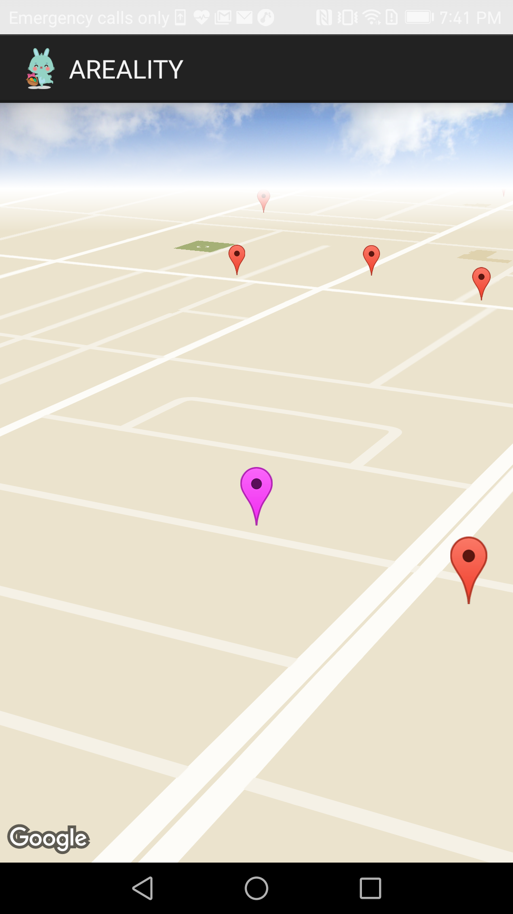

# AREALITY

A cross between Foursquare and Pokémon Go, AREALITY is an Android app that rewards users for discovering local landmarks.

AREALITY is a group project by Diane Zheng, Michael Hooton, Terry O'Shea and Tyler Weng.

## Overall Structure

AREALITY was built using a Java/Android front-end client and a Node.js backend following the Express.js application framework with a MongoDB database.

### Technologies & Frameworks

- [ ] MongoDB
- [ ] Express.js
- [ ] Android
- [ ] Node.js

## Features & Implementation

### 3-D Map with Intelligent Camera



Upon signing in, the user is immersed into the world of AREALITY, where they are presented with a 3-D map of their surroundings. The camera is centered around our protagonist, and follows them to wherever their desires may lead them.

#### Camera Position

`MapsActivity.java`
```java
private void setCameraPosition() {
  mCurrLocationMarker.setPosition(new LatLng(mLat, mLong));
  CameraPosition camera = new CameraPosition.Builder()
    .target(new LatLng(mLat, mLong))
    .zoom(18)
    .tilt(67.5f)
    .bearing(mAngle)
    .build();
  mMap.moveCamera(CameraUpdateFactory.newCameraPosition(camera));
  projection = mMap.getProjection();
}
```

### Landmark Page with Photo Cube Rotation

Users visit a landmark's page upon tapping its marker in the Maps Page.
In the landmark page, the user is presented with that landmark's overall rating, photos, its hours of availability and user reviews. The user may also swipe the photo cube to rotate it.

#### Photo Cube Rotation

`MYGLSurfaceView.java`
```java

public boolean onTouchEvent(MotionEvent e) {

  float x = e.getX();
  float y = e.getY();

  switch (e.getAction()) {
    case MotionEvent.ACTION_MOVE:

      float dx = x - mPreviousX;
      float dy = y - mPreviousY;

      mRenderer.setRot(dy/100, dx/10);
      mRenderer.setAngle(
        mRenderer.getAngle() +
        ((dx + dy) * TOUCH_SCALE_FACTOR));
      requestRender();
  }

  mPreviousX = x;
  mPreviousY = y;
  return true;
}
```

### User Profiles with Points and Badges

Users accumulate points upon discovery and entry of a new landmark. Users are also awarded badges upon accomplishing certain feats (e.g. "Walked 5 km", "Explored 3 days in a row ", etc.).

## New Directions

AREALITY is built upon an easily extensible foundation and can be used as a sandbox to create any sort of app based upon discovery and navigation. Future avenues include:

### Integration with OpenTable API

Some restaurants are truly historic and have earned their place as a landmark in AREALITY. Users will be able to make reservations to these restaurants upon visiting their landmark page.

### AR

Users will be able to see informtion from a nearby landmark by looking at it through their phone's camera a la Yelp Monocle.

### Avatar

AREALITY currently has the user portrayed as an anonymous hero. In a future release, the user will be displayed as a living, breathing, map-traversing hero complete with a customizable outfit.

### AREALITY Store

Users work tirelessly to accumulate points and should be rewarded for their dedication to the game. Users will be able to purchase in-game items (e.g. stamps, avatar customization, etc.) in exchange for their hard-earned points.
